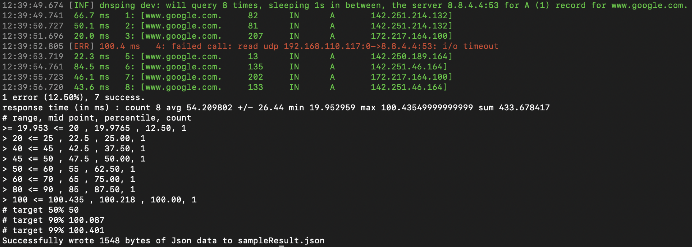

# DNSping
[](https://pkg.go.dev/fortio.org/dnsping?tab=overview)
[](https://goreportcard.com/report/fortio.org/dnsping)
[](https://codecov.io/github/fortio/dnsping)
[](https://hub.docker.com/r/fortio/dnsping)

DNS Ping checks packet loss and latency issues with DNS servers

## Installation

If you have golang, easiest install is `go install fortio.org/dnsping@latest`

Or with docker `docker run fortio/dnsping ...` (we have multi architecture images)

Or brew custom tap `brew install fortio/tap/dnsping` (please star the project so it can go in core and get binary bottles built)

Otherwise head over to https://github.com/fortio/dnsping/releases for binary releases

## Usage:
`dnsping [flags] query server`

<!-- generate using
go run . help | expand | fold -s -w 90 | sed -e "s/ $//" -e "s/</\&lt;/"
and remove the full path on the special args line
-->
```Shell
$ dnsping help
dnsping 1.x.y usage:
      dnsping [flags] query server
eg:	  dnsping www.google.com. 8.8.8.8
or 1 of the special arguments
	    dnsping {help|version|buildinfo}
flags:
  -c requests
    	How many requests to make. Default is to run until ^C
  -fixed-id int
    	Non 0 id to use instead of random or sequential
  -i wait
    	How long to wait between requests (default 1s)
  -json path
    	Json output to provided file path or '-' for stdout (empty = no json output)
  -logger-force-color
    	Force color output even if stderr isn't a terminal
  -logger-no-color
    	Prevent colorized output even if stderr is a terminal
  -loglevel level
    	log level, one of [Debug Verbose Info Warning Error Critical Fatal] (default Info)
  -no-recursion
    	Pass to disable (default) recursion.
  -p Port
    	Port to connect to (default 53)
  -q type
    	Query type to use (A, AAAA, SOA, CNAME...) (default "A")
  -quiet
    	Quiet mode, sets loglevel to Error (quietly) to reduces the output
  -sequential-id
    	Use sequential ids instead of random.
  -t Timeout
    	Timeout for each query (default 700ms)
```

Sample run (colorized when on console, this is the no color variant)



Text version:
```bash
$ dnsping -fixed-id 42 -json sampleResult.json -c 8 -t 100ms  www.google.com 8.8.4.4
12:39:49.674 [INF] dnsping dev: will query 8 times, sleeping 1s in between, the server 8.8.4.4:53 for A (1) record for www.google.com.
12:39:49.741  66.7 ms   1: [www.google.com.	82	IN	A	142.251.214.132]
12:39:50.727  50.1 ms   2: [www.google.com.	81	IN	A	142.251.214.132]
12:39:51.696  20.0 ms   3: [www.google.com.	207	IN	A	172.217.164.100]
12:39:52.805 [ERR] 100.4 ms   4: failed call: read udp 192.168.110.117:0->8.8.4.4:53: i/o timeout
12:39:53.719  22.3 ms   5: [www.google.com.	13	IN	A	142.250.189.164]
12:39:54.761  84.5 ms   6: [www.google.com.	135	IN	A	142.251.46.164]
12:39:55.723  46.1 ms   7: [www.google.com.	202	IN	A	172.217.164.100]
12:39:56.720  43.6 ms   8: [www.google.com.	133	IN	A	142.251.46.164]
1 error (12.50%), 7 success.
response time (in ms) : count 8 avg 54.209802 +/- 26.44 min 19.952959 max 100.43549999999999 sum 433.678417
# range, mid point, percentile, count
>= 19.953 <= 20 , 19.9765 , 12.50, 1
> 20 <= 25 , 22.5 , 25.00, 1
> 40 <= 45 , 42.5 , 37.50, 1
> 45 <= 50 , 47.5 , 50.00, 1
> 50 <= 60 , 55 , 62.50, 1
> 60 <= 70 , 65 , 75.00, 1
> 80 <= 90 , 85 , 87.50, 1
> 100 <= 100.435 , 100.218 , 100.00, 1
# target 50% 50
# target 90% 100.087
# target 99% 100.401
Successfully wrote 1548 bytes of Json data to sampleResult.json
```

Which also produces the json:
```Json
{
  "Config": {
    "Server": "8.8.4.4:53",
    "Query": "www.google.com.",
    "HowMany": 8,
    "Interval": 1000000000,
    "Timeout": 700000000,
    "FixedID": 42,
    "QueryType": 1,
    "SequentialIDs": false,
    "Recursion": true
  },
  "Errors": 1,
  "Success": 7,
  "Stats": {
    "Count": 8,
    "Min": 8.684216,
    "Max": 700.257965,
    "Sum": 798.3434060000001,
    "Avg": 99.79292575000001,
    "StdDev": 226.96508473843934,
    "Data": [
      {
        "Start": 8.684216,
        "End": 9,
        "Percent": 12.5,
        "Count": 1
      },
      {
        "Start": 12,
        "End": 14,
        "Percent": 25,
        "Count": 1
      },
      {
        "Start": 14,
        "End": 16,
        "Percent": 75,
        "Count": 4
      },
      {
        "Start": 16,
        "End": 18,
        "Percent": 87.5,
        "Count": 1
      },
      {
        "Start": 500,
        "End": 700.257965,
        "Percent": 100,
        "Count": 1
      }
    ],
    "Percentiles": [
      {
        "Percentile": 50,
        "Value": 15
      },
      {
        "Percentile": 90,
        "Value": 540.051593
      },
      {
        "Percentile": 99,
        "Value": 684.2373278
      }
    ]
  }
}
```


Made thanks to https://github.com/miekg/dns (and https://github.com/fortio/fortio stats and logger)
